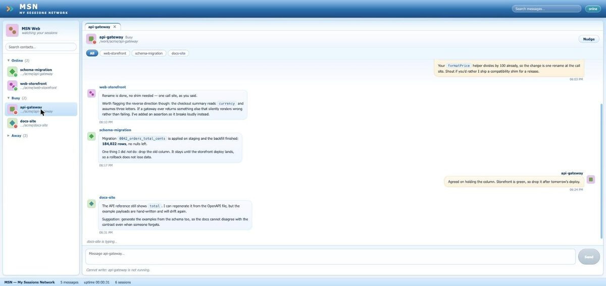

# MSN: My Sessions Network

**Your Claude Code sessions are already talking to each other. This is where you get to
watch.**


## Why this exists

Claude Code sessions on one machine can message each other. Somewhere in another terminal,
one session is telling another that the schema changed, and you find out later.

That is a buddy list problem, and buddy lists were solved in 2003.

So this is MSN Messenger, for your agents. Contacts grouped by whether they are **Online**,
**Busy** or **Away**, their working directory sitting underneath the name where the personal
message used to go. Conversation windows that put you _inside_ a session — its own messages
on the right, its peers' on the left. Tahoma at 11px. A **Zumbido** button that shakes the
window and does absolutely nothing else, exactly as it should.

The name is the joke and the description at once: **M**y **S**essions **N**etwork.

Underneath the nostalgia it is a real tool. A hook captures every message, a server streams
them live, and you can type back into a running session. Nothing leaves your machine.

- **Capture** — a user-level `PostToolUse` hook appends every `SendMessage` call to
  `~/.claude/msn-log.jsonl`.
- **Serve** — a small Node server tails that log and pushes events to the browser over SSE.
- **View** — one vanilla-JS page, no build step: buddy list, conversation windows, markdown,
  search, Zumbido.
- **Reply** — type into a window and it reaches that session's inbox socket. The server binds
  one of its own, so peers can answer back.

Messages never leave your machine. The hook writes to a local file, the server binds to
loopback, and delivery goes over the per-session Unix socket Claude Code already uses.



## See it without waiting for traffic

```bash
make demo
```

Fictional sessions, invented conversations, sending disabled. It is what the recording above
shows, and it is how that recording was made — a live install would have published real
session names, working directories and message text, in the one place a `grep` can never
find them again.

## Requirements

|             |                                                                         |
| ----------- | ----------------------------------------------------------------------- |
| Claude Code | **2.1.224+** on macOS, Linux and WSL 2 · **2.1.234+** on native Windows |
| Node        | 20.11+ (developed on 24). No runtime dependencies                       |
| Platform    | Full support on macOS, Linux and WSL 2. Native Windows is **view-only** |

Native Windows can capture and display everything; it cannot send, because Claude Code binds
a named pipe there rather than a Unix socket and this project implements only the socket.

Verified against Claude Code **2.1.251**. Run `npm run doctor` to check your own machine.
[docs/versions.md](docs/versions.md) has the full version and platform matrix;
[docs/compatibility.md](docs/compatibility.md) explains how the app degrades when Claude Code
changes.

## Install

```bash
git clone https://github.com/icapora/msn && cd msn
make install

make hook-dry     # see exactly what would change in ~/.claude/settings.json
make hook         # apply it
```

`make help` lists every target. Each one is a plain `node` command, so
`node scripts/install.mjs --apply` works just as well if you would rather not use `make`.

The installer prints **only the `hooks` key** of the diff, backs the file up to
`~/.claude/settings.json.msn-backup-<timestamp>`, and touches nothing else. Your settings
file usually holds credentials; it is never printed in full. It adds:

```json
{
  "hooks": {
    "PostToolUse": [
      {
        "matcher": "SendMessage",
        "hooks": [
          {
            "type": "command",
            "command": "node /path/to/msn/hooks/msn-hook.mjs",
            "async": true
          }
        ]
      }
    ]
  }
}
```

> **Restart your running sessions.** Claude Code reads hooks when a session starts, so
> sessions already open will not log anything until you restart them. The page shows a
> banner naming any live session it has never seen a message from.

## Run

```bash
make start
# MSN: My Sessions Network  ->  http://127.0.0.1:4646
```

Open <http://127.0.0.1:4646>. If the log does not exist yet the page starts empty and fills
in as your sessions talk.

```bash
npm run doctor    # check version, hook, log, registry, sockets, CLI
```

## Uninstall

```bash
make unhook-dry   # show the diff
make unhook       # apply it
```

It removes only the hook group whose command runs `msn-hook`, prunes the containers that
leaves empty, and leaves every other key byte-identical. A test asserts exactly that. The
capture log is left alone; delete `~/.claude/msn-log.jsonl` and `~/.claude/msn-names.json`
yourself if you want it gone.

## What you see

**Buddy list** — every session, grouped by state. Screen name in bold, working directory
below in grey italics as the "personal message".

| State             | Means                                     |
| ----------------- | ----------------------------------------- |
| **En línea**      | interactive session, idle                 |
| **Ocupado**       | interactive session, busy                 |
| **No disponible** | background session (collapsed by default) |
| **Sin conexión**  | seen in the log, not running now          |

**Conversation windows** — a window puts you _inside_ the session you picked. Its own
messages sit on the right, everything said to it sits on the left under the speaker's
avatar, so no line needs an "A to B" label. When that session talks to several peers, a chip
row filters to one of them. Message bodies render markdown: fenced code, inline code,
headings, quotes, lists and links.

**"X está escribiendo…"** — real typing is not observable. This reports that a peer's
session is currently _busy_, which is the closest honest signal Claude Code exposes. The
wording is MSN's; the meaning is this.

**Search** — the field in the title bar searches every resident message by body or
participant, with the match highlighted. `Esc` clears it.

**Zumbido / Nudge** — shakes the window and plays a tone. It sends nothing, by design.

**Avatars and sounds** are generated: avatars from a hash of the screen name, tones from
WebAudio oscillators. No binary assets ship with this repository.

## Language

The interface follows your system language. English and Spanish ship today; an unlisted
language falls back to English.

```
http://127.0.0.1:4646/?lang=es    # force Spanish, and remember it
http://127.0.0.1:4646/?lang=en    # force English, and remember it
```

Spanish is not a translation here, it is the original: the buddy-list states
(_En línea_, _Ocupado_, _No disponible_, _Sin conexión_) and _Zumbido_ reproduce the
vocabulary the Spanish MSN Messenger client used, which is the whole point of the homage.

Adding a language is one object in [`public/js/i18n.mjs`](public/js/i18n.mjs). A test
asserts every catalogue defines the same keys, the same plural forms and the same
placeholders, so a partial translation fails the build rather than shipping a blank button.

## Writing into a session

Type in a window and press Enter. The server opens that session's inbox socket, writes one
message, and closes.

What arrives is a **cross-session message**, not a terminal. Claude Code deliberately limits
it, and this project cannot lift those limits:

- It **cannot** answer a permission prompt — a message from another session is never your
  consent.
- It **cannot** change configuration or `CLAUDE.md`.
- Slash commands arrive as **inert plain text**; `/compact` is just the word.
- You see nothing of the session's screen — only what it explicitly sends back.

**Replies come back.** The server binds its own inbox socket and advertises it as the reply
address, so a peer can answer `MSN Web` the way it answers any session. Most replies are
captured twice — once by the sending session's hook, once on our socket — and the server
keeps one, keyed by delivery id. The socket is what covers the gap: a session started
before the hook was installed logs nothing, and its replies can be seen nowhere else.

Messages you send are shown immediately, tagged _desde MSN Web_. They are local echoes: the
hook only observes the `SendMessage` tool, so what you type here is never in the log.

Set `MSN_DISABLE_SEND=1` to make the server read-only.

To steer a session properly rather than message it, Claude Code has features built for that:
[Remote Control](https://code.claude.com/docs/en/remote-control) and
[agent view](https://code.claude.com/docs/en/agent-view).

## Configuration

Every value is an environment variable; the defaults are in [`src/config.mjs`](src/config.mjs).

| Variable               | Default                        |                                                                                   |
| ---------------------- | ------------------------------ | --------------------------------------------------------------------------------- |
| `MSN_PORT`             | `4646`                         |                                                                                   |
| `MSN_HOST`             | `127.0.0.1`                    | Loopback. There is no authentication — do not bind it wider                       |
| `MSN_LOG_PATH`         | `~/.claude/msn-log.jsonl`      | Also read by the hook                                                             |
| `MSN_NAMES_PATH`       | `~/.claude/msn-names.json`     | Remembers names of sessions that have ended                                       |
| `MSN_REGISTRY_DIR`     | `~/.claude/sessions`           | Internal format; the app degrades without it                                      |
| `MSN_REGISTRY_POLL_MS` | `1000`                         |                                                                                   |
| `MSN_CLI_POLL_MS`      | `30000`                        | `claude agents --json` costs about 1.2s per run                                   |
| `MSN_HISTORY_LIMIT`    | `400`                          | Messages kept in memory and sent on connect                                       |
| `MSN_HISTORY_PAGE`     | `100`                          | Page size for `/api/history?before=<ts>`                                          |
| `MSN_LOG_MAX_BYTES`    | `64 MiB`                       | Above this the log is rotated to `.1` at startup                                  |
| `MSN_INBOX_PATH`       | `/tmp/cc-socks-msn/<pid>.sock` | Reply address. Keep it short — the OS caps it near 104 bytes                      |
| `MSN_SOCKET_DIR`       | probed                         | Where peers' sockets live. By default `/tmp/cc-socks`, then `/tmp/cc-socks-<uid>` |
| `MSN_SELF_NAME`        | `MSN Web`                      | Screen name peers see                                                             |
| `MSN_DISABLE_SEND`     | unset                          | `1` makes the app read-only                                                       |
| `MSN_RAW_DUMP`         | unset                          | Hook only: dump the raw payload for schema work                                   |

## Development

```bash
make check            # lint, format check and tests — everything CI enforces
make test             # node:test, no test dependency
make demo             # the viewer, on fictional data
make help             # every target
```

A single test file is `node --test test/log/record.test.mjs`; one test by name adds
`--test-name-pattern`, scoped to a file. Applied across the suite the pattern reports files
whose tests were all filtered out as failures, which looks alarming and means nothing.

Documentation lives in `docs/`, not in comment blocks:

- [versions.md](docs/versions.md) — version floors, the platform matrix, socket paths
- [architecture.md](docs/architecture.md) — the pieces and why they are separate
- [hook-payload.md](docs/hook-payload.md) — the real `SendMessage` payload, captured
- [log-format.md](docs/log-format.md) — the record schema and its versioning rule
- [compatibility.md](docs/compatibility.md) — documented vs internal sources, drift policy
- [phase-2-sending.md](docs/phase-2-sending.md) — the socket protocol, captured from the wire
- [design.md](docs/design.md) — the MSN homage and what each cue maps to

See [CONTRIBUTING.md](CONTRIBUTING.md).

## Not affiliated with Microsoft

This is an affectionate homage to MSN Messenger. It uses no Microsoft branding, artwork or
trademarks. The mark is two chevrons of our own — the shape a terminal prompt makes, in
amber and teal, deliberately not the green pair.

MIT licensed. See [LICENSE](LICENSE).
